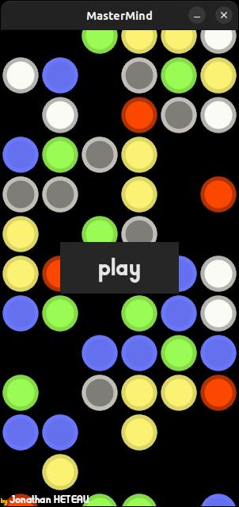
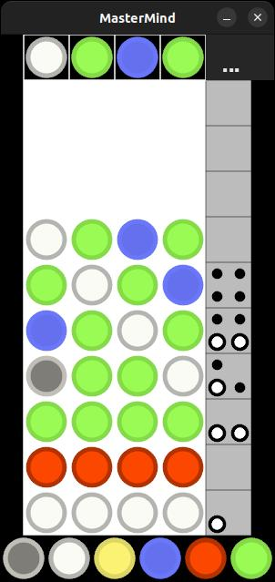

# Bevy Mastermind

Adaptation du jeu Mastermind avec le moteur de jeu [Bevy 0.5](https://bevyengine.org/) et [Rust](https://www.rust-lang.org/).

## Compilation 

Installer [Rust](https://www.rust-lang.org/tools/install)

Dépendances ubuntu pour Bevy:

    sudo apt-get install g++ pkg-config libx11-dev libasound2-dev libudev-dev.

Pour d'autres os, voir [ici](https://bevyengine.org/learn/book/getting-started/setup/#install-os-dependencies) 

    cargo build
    cargo run

## Capture d'écran 

